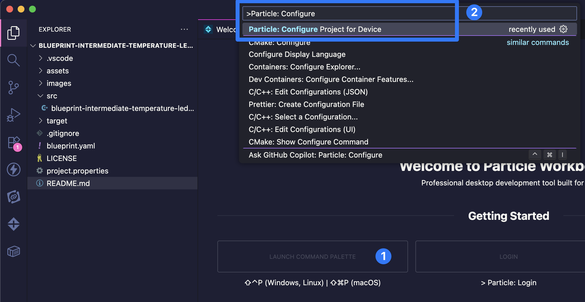
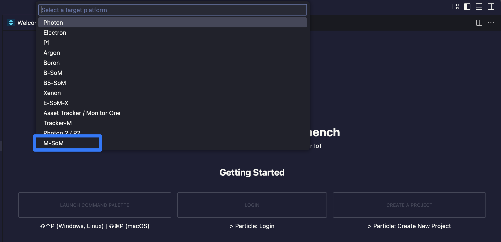
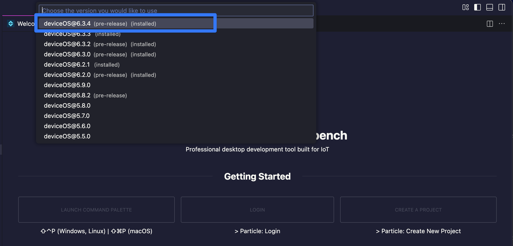
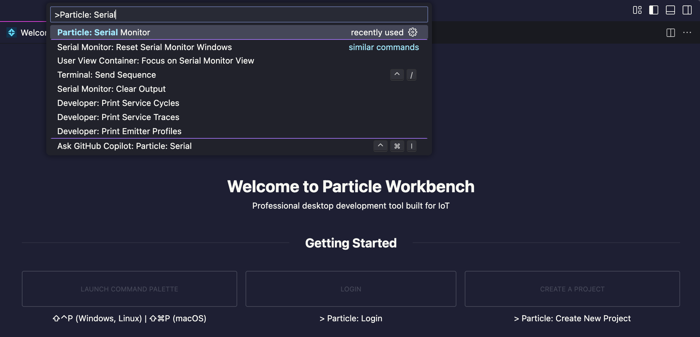
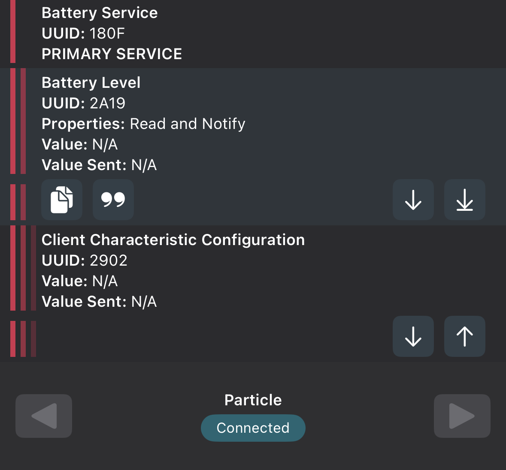

# Blueprint Beginnner BLE Battery

**Difficulty:** Beginner

**Estimated Time:** 30 minutes

**Hardware Needed:** Muon + MSoM + battery

---

### Overview

Learn how to advertise the Muon's current battery percentage using standard BLE battery service.

---

### Tools & Materials

- Muon
- MSoM
- USB cable
- Compatible battery

---

### Steps

1. **Clone this repository:**

   ```bash
   git clone https://github.com/particle-iot/blueprint-beginner-ble-battery.git
   cd blueprint-beginner-ble-battery
   ```

2. **Open the project** in Particle Workbench or your preferred editor.

3. **Flash to your device:**
   1. Configure project for your device using Particle Workbench and the command pallette (cmd / ctrl + shift + p):
      
   2. Select your device model and Device OS release:
      
      

4. **Open a serial terminal**:
   1. Open a serial monitor session by choosing `Particle: Serial monitor` from the command pallette:
      

5. **Observe output**:
   1. The program will begin to log the battery readings to the serial monitor:

   ```bash
   0000076761 [app] INFO: V=4.03V SoC=65.9% nSoC=77.5%
   0000091779 [app] INFO: V=4.02V SoC=66.0% nSoC=77.6%
   0000106797 [app] INFO: V=4.02V SoC=66.1% nSoC=77.8%
   ```

---

### How It Works

1. The standard battery service and characteristic are first assigned at the top of `main.cpp`:

```cpp
const BleUuid batteryService(0x180F);

BleCharacteristic batteryLevelChar(
    "bat", // short description
    BleCharacteristicProperty::READ | BleCharacteristicProperty::NOTIFY,
    BleUuid(0x2A19), // Battery Level characteristic
    batteryService   // Service UUID this characteristic belongs to
);
```

2. Then, they're initialized in `setup()`:

```cpp
  BLE.addCharacteristic(batteryLevelChar);
  BLE.setDeviceName("Particle");
  BleAdvertisingData adv;
  adv.appendServiceUUID(batteryService);
  BLE.advertise(&adv);
```

3. The power Muon's power PM-BAT is then configured to enable battery readings:

```cpp
  SystemPowerConfiguration cfg = System.getPowerConfiguration();
  cfg.feature(SystemPowerFeature::PMIC_DETECTION) // external PMIC + fuel gauge detection
      .auxiliaryPowerControlPin(D7)               // Muon uses D7 for 3V3_AUX control
      .interruptPin(A7);                          // Muon uses A7 for PMIC/fuel gauge interrupt
  System.setPowerConfiguration(cfg);
```

4. Finally, the voltage and battery percent are stored and logged to both the serial port as well as the battery characteristic:

```cpp
  float v = fuel.getVCell();            // volts (returns -1.0 if unreadable)
  float soc = fuel.getSoC();            // 0–100% (returns -1.0 if unreadable)
  float nsoc = fuel.getNormalizedSoC(); // normalized 0–100%
  uint8_t pct = (uint8_t)nsoc;          // battery percent for characteristic

  batteryLevelChar.setValue(&pct, 1);
  Log.info("V=%.2fV SoC=%.1f%% nSoC=%.1f%%", v, soc, nsoc);
```

---

### Usage

Connect to the device using a BLE testing app such as [nRF Connect](https://apps.apple.com/us/app/nrf-connect-for-mobile/id1054362403) to view the battery readings from the device via the standard battery BLE service.



---

### Topics Covered

- [PM-BAT](https://docs.particle.io/hardware/power/pm-bat-datasheet/#overview)
- [Particle Muon](https://docs.particle.io/reference/datasheets/m-series/muon-datasheet/)
- [Particle BLE](https://docs.particle.io/reference/device-os/api/bluetooth-le-ble/bluetooth-le-ble/)

---

### Extensions

Try combining with the [Gen 4 power management application note](https://www.particle.io/application-notes/power-optimization-strategies-for-generation-4-devices/).
